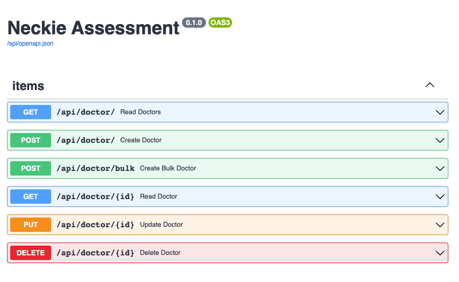

# Pesonal Projects

------------
### Installation:

#### 1. Docker
Requisition:
- Docker
- Docker compose


At a current folder, place a docker_compose.yml

Run a command for building a container:

```
$ docker-compose build

```
Run a container
```
$ docker-compose up -d
```
> When you run `docker-compose up -d` (run a server), database will create and migrate. 

When we have any changes in models, run a command follow below.
```
$ docker-compose exec api alembic revision --autogenerate "Alter a column" #create versions file for mark a changing

$ docker-compose exec api alembic upgrade head  # Execute the changes.
```
To check the logs, run:
```
docker-compose logs
```
Navigate to http://localhost:9000/docs for viewing API documents


#### 3. Without docker
Requisition:
- Any virtual environment (conda, python venv) (https://docs.python.org/3/library/venv.html)
- Pip installation (https://pip.pypa.io/en/stable/installation/)

Creating a virtual environment

```
python3 -m venv /path/to/venv
```

Activate your virtual environment
```
source [/path/to/venv]/bin/activate
```
Install libraries from requirements.txt
> please make sure pip3 installed, come back to Requisition.
```
(venv) $ pip3 install -r requirements.txt
```
Migrate database with alembic

```
python3 backend_pre_start.py
alembic upgrade head
```

Run a server
```
uvicorn main:app --host 0.0.0.0 --port 9000
```
Navigate to http://localhost:9000/docs for viewing API documents




